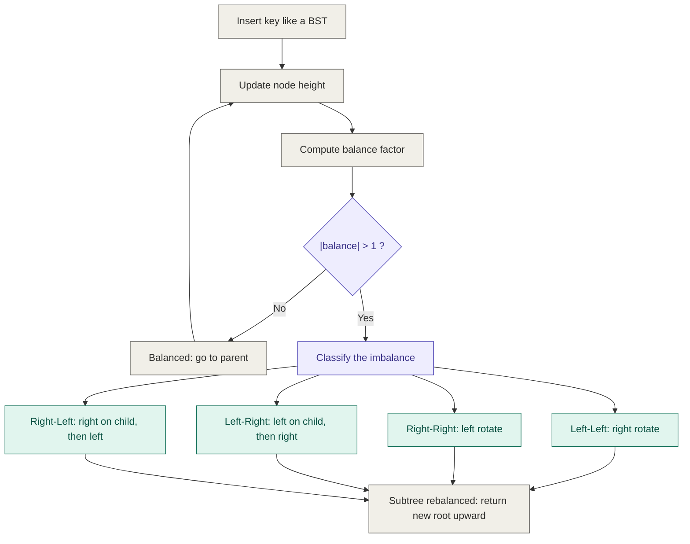

```mermaid
flowchart TD
    A[Insert key like a BST] --> B[Update node height]
    B --> C[Compute balance factor]
    C --> D{"|balance| > 1 ?"}

    D -- No --> E[Balanced: go to parent]
    E --> B

    D -- Yes --> F[Classify the imbalance]
    F --> LL[Left-Left: right rotate]
    F --> RR[Right-Right: left rotate]
    F --> LR[Left-Right: left on child, then right]
    F --> RL[Right-Left: right on child, then left]

    LL --> G[Subtree rebalanced: return new root upward]
    RR --> G
    LR --> G
    RL --> G

    classDef neutral fill:#F1EFE8,stroke:#5F5E5A,color:#2C2C2A;
    classDef decision fill:#EEEDFE,stroke:#534AB7,color:#3C3489;
    classDef rotate fill:#E1F5EE,stroke:#0F6E56,color:#085041;

    class A,B,C,E,G neutral;
    class D,F decision;
    class LL,RR,LR,RL rotate;
```